# CoPaw 代码架构分析文档

## 1. 概述

CoPaw 是一个基于 AgentScope 框架构建的 AI Agent 系统，提供多渠道接入、工具调用、技能管理、内存管理等功能。

### 1.1 代码统计

| 模块 | 代码行数 | 说明 |
|------|---------|------|
| **agents/tools** | 4,589 | 工具实现 |
| **cli** | 4,176 | 命令行接口 |
| **agents** (核心) | 4,054 | Agent 核心逻辑 |
| **app/routers** | 3,058 | API 路由 |
| **app/runner** | 2,101 | Agent 运行器 |
| **app/channels** | 2,019 | 消息渠道 |
| **providers** | 1,950 | LLM 提供商 |
| **agents/utils** | 1,324 | 工具函数 |
| **local_models** | 1,218 | 本地模型支持 |
| **config** | 1,178 | 配置管理 |
| **其他模块** | ~29,014 | 其余组件 |
| **总计** | **~54,681** | - |

---

## 2. 系统架构总览

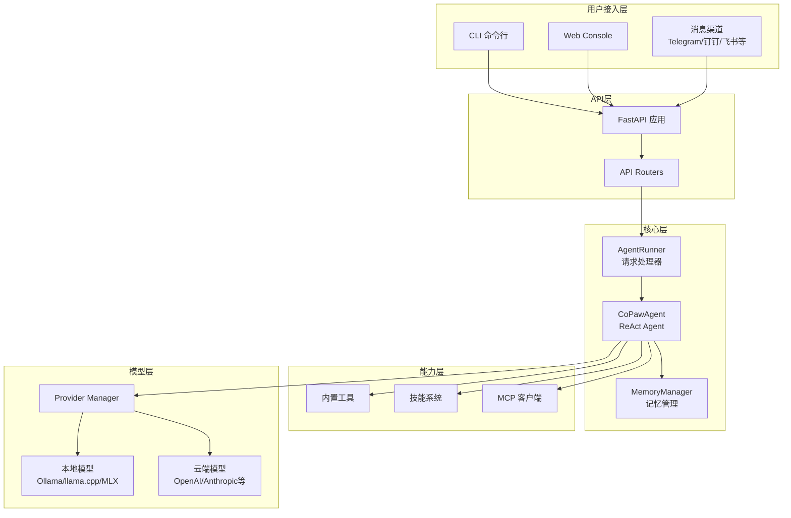

---

## 3. 目录结构

```
src/copaw/
├── agents/           # AI Agent 核心实现
│   ├── hooks/        # 钩子系统
│   ├── memory/       # 内存管理
│   ├── skills/       # 内置技能
│   ├── tools/        # 内置工具
│   ├── utils/        # 工具函数
│   ├── react_agent.py      # CoPawAgent 主类
│   ├── model_factory.py    # 模型工厂
│   ├── command_handler.py  # 命令处理
│   └── skills_manager.py   # 技能管理
├── app/              # FastAPI 应用
│   ├── channels/     # 消息渠道
│   ├── crons/        # 定时任务
│   ├── mcp/          # MCP 客户端管理
│   ├── routers/      # API 路由
│   ├── runner/       # Agent 运行器
│   └── _app.py       # 应用入口
├── cli/              # 命令行接口
├── config/           # 配置管理
├── providers/        # LLM 提供商
├── local_models/     # 本地模型后端
├── security/         # 安全模块
├── token_usage/      # Token 用量统计
└── utils/            # 公共工具
```

---

## 4. 核心模块详解

### 4.1 Agents 模块

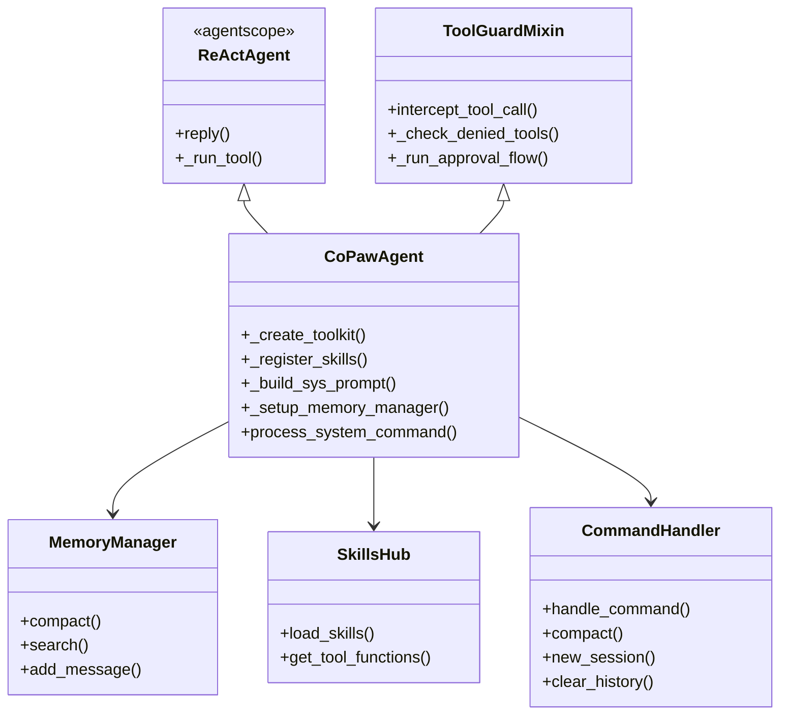

#### 核心类说明

| 类名 | 文件 | 功能 |
|------|------|------|
| `CoPawAgent` | `react_agent.py` | 核心 Agent，继承 ReActAgent，集成工具/技能/内存 |
| `MemoryManager` | `memory/memory_manager.py` | 基于 ReMeLight 的记忆管理 |
| `CommandHandler` | `command_handler.py` | 处理 `/compact`, `/new` 等系统命令 |
| `SkillsHub` | `skills_hub.py` | 技能加载和工具注册 |
| `ToolGuardMixin` | `tool_guard_mixin.py` | 工具安全拦截 |

---

### 4.2 App 模块

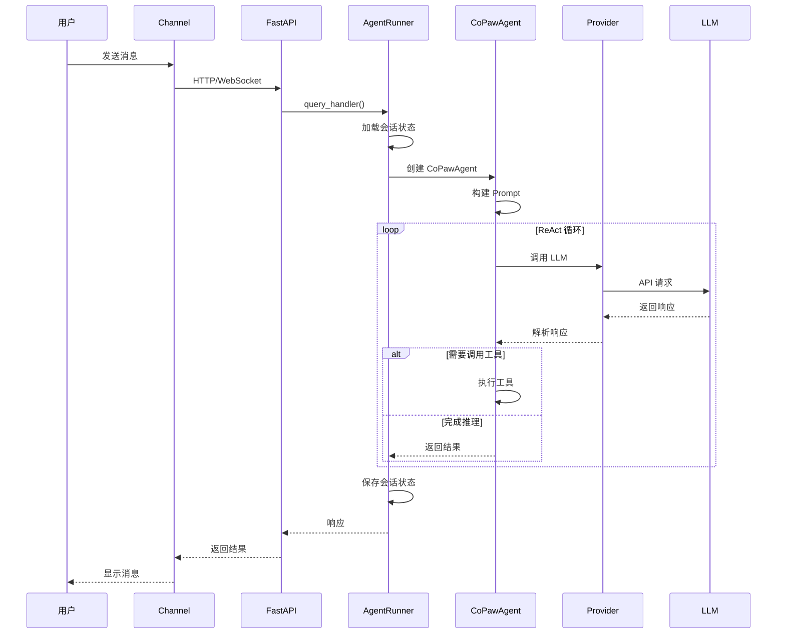

#### 应用生命周期

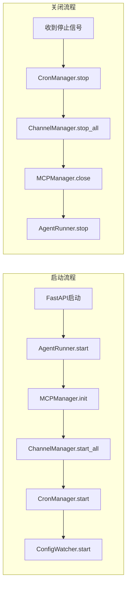

---

### 4.3 消息渠道 (Channels)

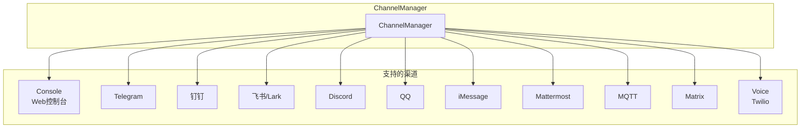

---

### 4.4 Providers 模块

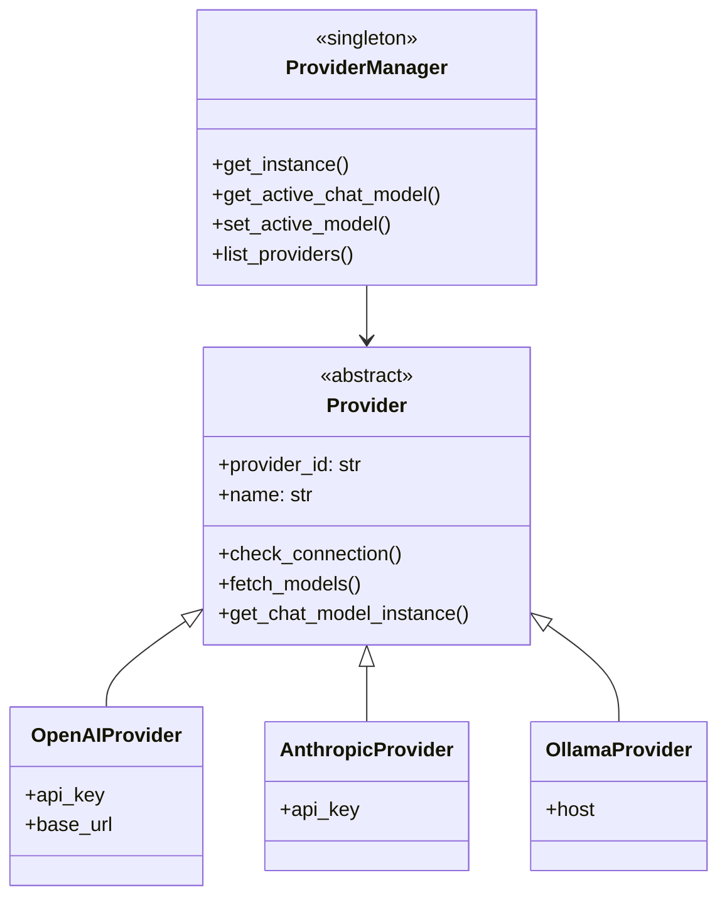

#### 支持的 Provider

| Provider ID | 名称 | 类型 |
|-------------|------|------|
| `openai` | OpenAI | 云端 |
| `anthropic` | Anthropic | 云端 |
| `azure-openai` | Azure OpenAI | 云端 |
| `dashscope` | DashScope (阿里云) | 云端 |
| `modelscope` | ModelScope | 云端 |
| `minimax` | MiniMax | 云端 |
| `ollama` | Ollama | 本地 |
| `lmstudio` | LM Studio | 本地 |
| `llamacpp` | llama.cpp | 本地 |
| `mlx` | MLX (Apple Silicon) | 本地 |

---

### 4.5 CLI 模块

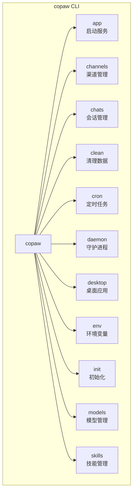

---

## 5. 内置工具

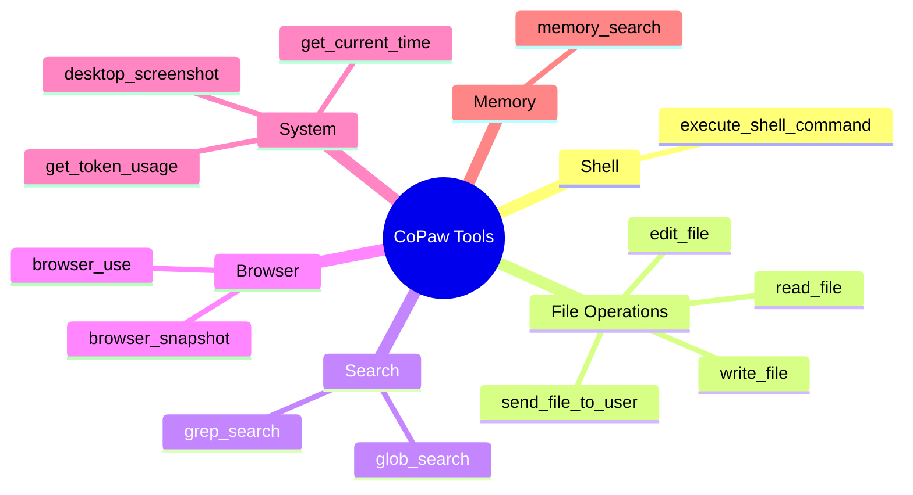

---

## 6. 技能系统 (Skills)

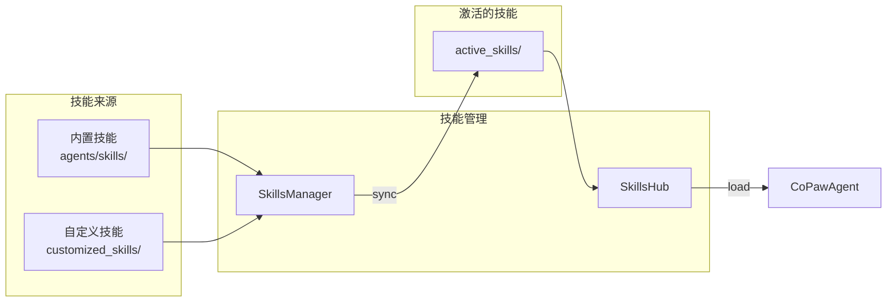

#### 内置技能列表

- `browser_visible` - 浏览器可视化
- `cron` - 定时任务
- `dingtalk_channel` - 钉钉频道
- `docx` - Word 文档处理
- `pdf` - PDF 处理
- `pptx` - PPT 处理
- `xlsx` - Excel 处理
- `file_reader` - 文件读取
- `himalaya` - 邮件客户端
- `news` - 新闻获取

---

## 7. 安全机制

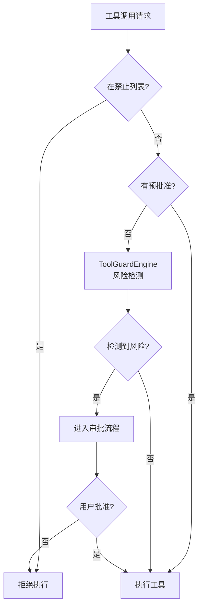

---

## 8. 数据流架构

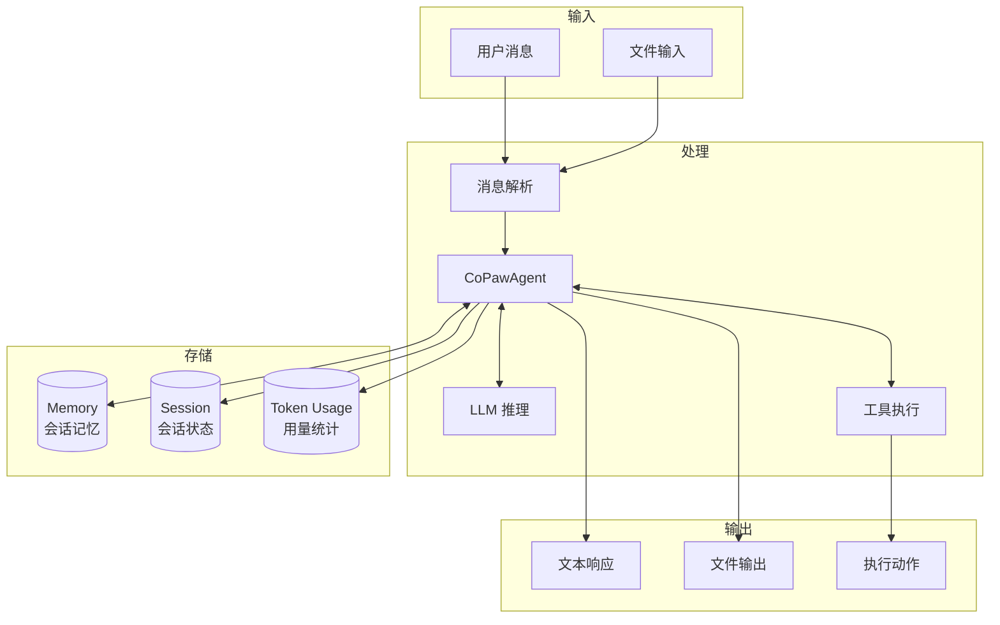

---

## 9. 配置系统

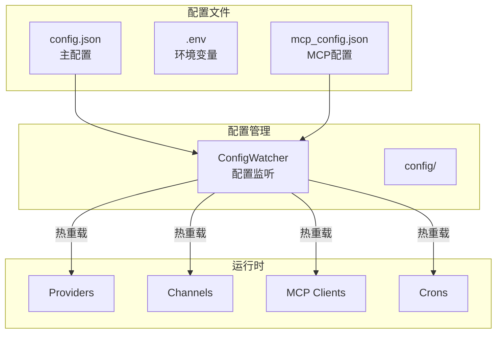

---

## 10. 模块依赖关系

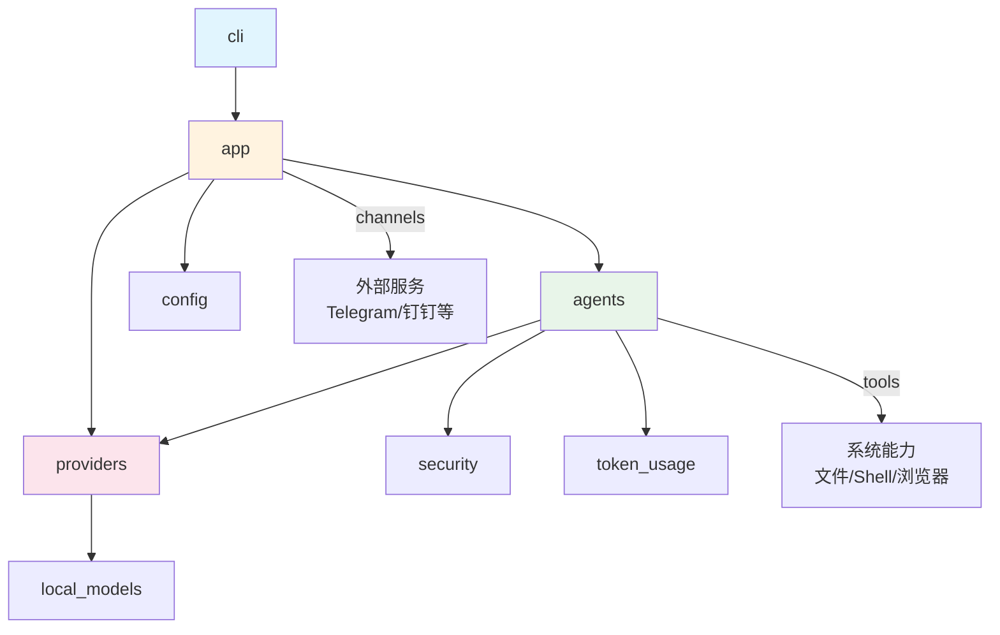

---

## 11. 总结

CoPaw 是一个功能完整的 AI Agent 系统，具有以下特点：

1. **模块化设计** - 清晰的层次结构，各模块职责明确
2. **多渠道支持** - 支持 10+ 消息渠道接入
3. **灵活的模型接入** - 支持云端和本地多种 LLM Provider
4. **可扩展的技能系统** - 内置技能 + 自定义技能
5. **完善的安全机制** - 工具调用审批流程
6. **热重载配置** - 支持运行时配置更新

核心代码约 **54,681 行**，主要分布在 Agent 核心 (8,000+)、CLI (4,000+)、App 服务 (8,000+)、Provider (2,000+) 等模块。
